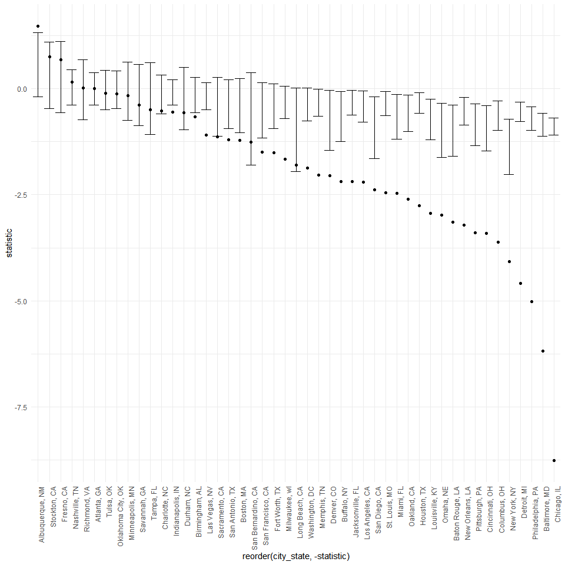
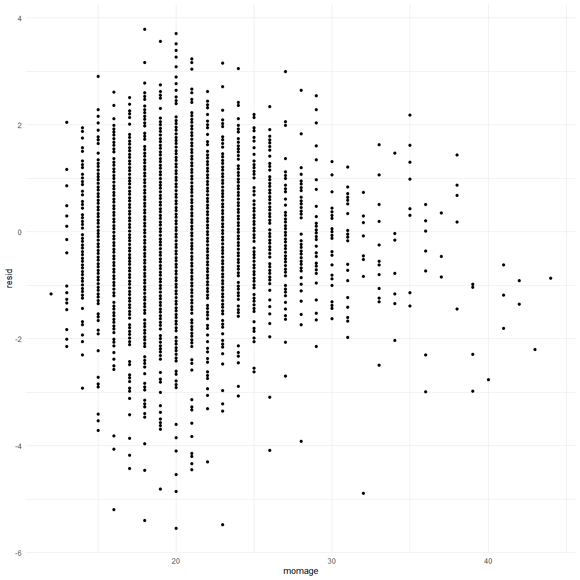
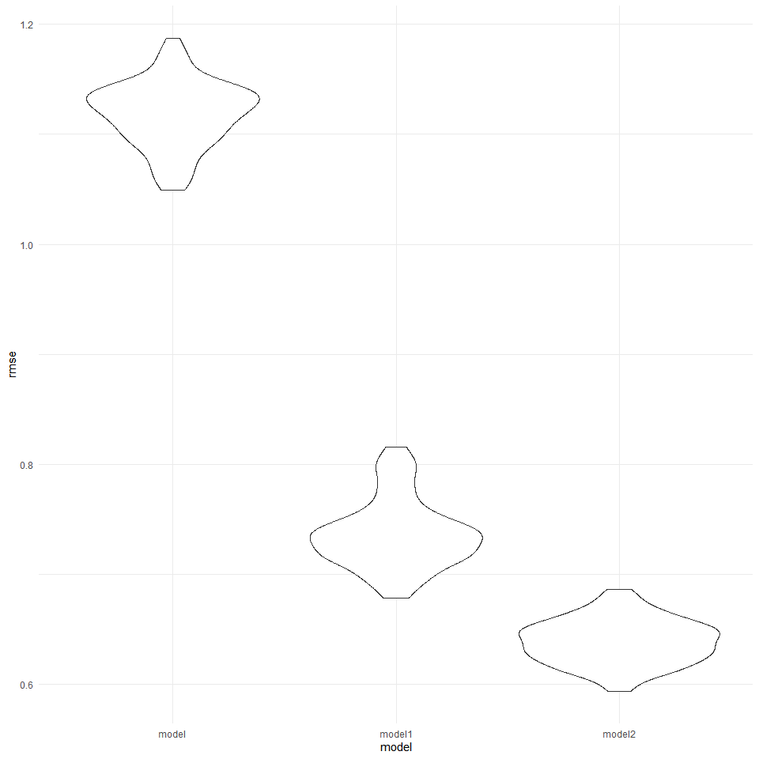

p8105_hw6_as6447
================
Armaan Sodhi
2022-12-01

## Problem 2

``` r
homicide_data = read.csv('data/homicide-data.csv')%>%
   janitor::clean_names()%>%
   unite('city_state',city:state,remove=FALSE, sep = ', ')%>%
      unite('Victim_full_name',victim_first:victim_last,remove=FALSE, sep = ' ')%>%
   select(-city,-state,-victim_last,-victim_first)%>%
   rename(longitude=lon, latitude=lat)%>%
   mutate(
      unsolved_murder = if_else(disposition %in% c("Closed without arrest","Open/No arrest"),1, 0),
      victim_age=as.numeric(victim_age),   
      resolved = as.numeric(disposition == "Closed by arrest"))%>% filter(victim_race == 'Black'|victim_race=='White') %>% filter(!city_state %in% c('Phoenix, AZ','Kansas City, MO ','Tulsa, AL'))
```

I Created a `city_state` variable using a similar process to Homework
\#5 where I used the `unite` function to combine the city and state
variables together.I also did this with the victim names, combining the
first and last name together.

The `Unsolved_murder` variable was created through using an `if_else`
statment on `disposition` and selecting if an individuals murder was
unsolved (1) or solved (0).

The `resolved` variable was also created.

I then omitted the cities: Dallas, TX; Phoenix, AZ; Kansas City, MO and
Tulsa, AL as they either did not indicate race or were data entry
mistakes.

I limited my analysis to for whom `victim_race` is `white` or `black`.
and converted `victim_age` to numeric.

``` r
baltimore_df = 
  homicide_data%>% 
  filter(city_state == "Baltimore, MD") %>% 
  select(resolved, victim_age, victim_race, victim_sex)
```

``` r
fit_logistic = 
  baltimore_df %>% 
  glm(resolved ~ victim_age + victim_race + victim_sex, data = ., family = binomial())
```

``` r
fit_logistic %>% 
  broom::tidy() %>% 
  mutate(adjusted_OR = exp(estimate),
         lower_bound_CI = exp(estimate)-1.96*std.error,
         upperbound_CI = exp(estimate) +1.96*std.error
)%>%
  select(term, log_OR = estimate, adjusted_OR, lower_bound_CI,upperbound_CI,  p.value) %>% 
  knitr::kable()
```

| term             |     log_OR | adjusted_OR | lower_bound_CI | upperbound_CI |   p.value |
|:-----------------|-----------:|------------:|---------------:|--------------:|----------:|
| (Intercept)      |  0.3099810 |   1.3633992 |      1.0276614 |     1.6991370 | 0.0703525 |
| victim_age       | -0.0067272 |   0.9932953 |      0.9867812 |     0.9998095 | 0.0429574 |
| victim_raceWhite |  0.8417563 |   2.3204389 |      1.9779952 |     2.6628826 | 0.0000015 |
| victim_sexMale   | -0.8544628 |   0.4255117 |      0.1546864 |     0.6963371 | 0.0000000 |

A logistic regression was created measuring `Resolved` vs `unresolved`
as the outcome and victim `age`, `sex` and `race` as predictors.

``` r
fit_logistic_city = 
  homicide_data %>%
   nest(data=-city_state)%>%
   mutate(data,models=map(data, ~glm(resolved ~ victim_age + victim_race + victim_sex, data = ., family = binomial())),results = map(models, broom::tidy, conf.int = TRUE))%>%
   select(city_state,results)%>%
   unnest(cols = results)%>%
   filter(term != 'victim_sexUnknown')
```

I then ran a glm for each of the cities in the dataset.Utilizing a
“tidy” pipeline and using a purrr::map, list columns, and unnestto
create a dataframe with estimated ORs and CIs for each city.

``` r
fit_logistic_city%>% filter(
   term == 'victim_sexMale')%>%
   ggplot(aes(x=reorder(city_state,-statistic),y=statistic)) + geom_point() + geom_errorbar(aes(ymin = conf.low, ymax = conf.high )) + theme(axis.text.x = element_text(angle=90, hjust=1))
```



``` r
ggsave('data/cityregressions.pdf')
```

    ## Saving 10 x 10 in image

\##Problem3

``` r
birthweight_data = read.csv('data/birthweight.csv')%>%
   janitor::clean_names()%>%
   mutate(
      bwt=(bwt*0.00220462),
      babysex=  replace(babysex, babysex == 1 ,'Male'),
      babysex=  replace(babysex, babysex == 2 ,'Female'),
      frace=  replace(frace, frace == 1 ,'White'),
      frace=  replace(frace, frace == 2 ,'Black'),
      frace=  replace(frace, frace == 3 ,'Asian'),
      frace=  replace(frace, frace == 4 ,'Puerto Rican'),
      frace=  replace(frace, frace == 8 ,'Other'),
      frace=  replace(frace, frace == 9 ,'Unknown'),
      malform=  replace(malform, malform == 0 ,'Absent'),
      malform=  replace(malform, malform == 1 ,'Present'),
      mrace=  replace(mrace, mrace == 1 ,'White'),
      mrace=  replace(mrace, mrace == 2 ,'Black'),
      mrace=  replace(mrace, mrace == 3 ,'Asian'),
      mrace=  replace(mrace, mrace == 4 ,'Puerto Rican'),
      mrace=  replace(mrace, mrace == 8 ,'Other'),
      mheight = (mheight*2.54),
      fincome = (fincome*100)
   )
```

The data was loaded and tidied. Variables that were factors were
converted from numeric. These were the fathers and mothers race, which
were converted to the list the actual race/ethnicity rather than a
numbered code. There was also unit conversions for height (inches) and
weight (pounds) calculations . Income was converted to be in hundreds.

``` r
birthweight_regression = 
  birthweight_data %>% 
  glm(bwt ~ momage, data = .)

birthweight_regression%>%broom::tidy()
```

    ## # A tibble: 2 × 5
    ##   term        estimate std.error statistic  p.value
    ##   <chr>          <dbl>     <dbl>     <dbl>    <dbl>
    ## 1 (Intercept)   6.06     0.0905      67.0  0       
    ## 2 momage        0.0395   0.00438      9.03 2.57e-19

Research has previously suggested that a mothers age can impact the
birthweight of the baby.This modeling process involved a similar process
to the above homicide regression in Problem 2.

``` r
birthweight_data %>% 
  modelr::add_residuals(birthweight_regression) %>% 
   modelr::add_predictions(birthweight_regression)%>%
  ggplot(aes(x = momage, y = resid)) + geom_point()
```



``` r
ggsave('data/birthregressions.pdf')
```

    ## Saving 10 x 10 in image

A plot of model residuals against fitted values using `add_predictions`
and `add_residuals` was utilized in making this plot

``` r
cv_df = 
  crossv_mc(birthweight_data, 100)

model_df =
  cv_df %>% 
  mutate(
    train = map(train, as_tibble),
    test = map(test, as_tibble))
```

``` r
birthweight_models = 
  cv_df %>% 
   mutate(bwt_model_mine = map(train,~lm(bwt~momage, data = .x)),
   bwt_modelme_1 = map(train, ~lm(bwt~blength + gaweeks,data=.x)),
   bwt_modelme_2 = map(train, ~lm(bwt~bhead+blength+babysex+bhead*blength+bhead*babysex+babysex*blength+bhead*blength*babysex,data=.x)))%>%
      mutate(
         rmse_model = map2_dbl(bwt_model_mine, test, ~rmse(model =.x,data=.y)),
         rmse_model1 = map2_dbl(bwt_modelme_1, test, ~rmse(model =.x,data=.y)),
         rmse_model2 = map2_dbl(bwt_modelme_2, test, ~rmse(model =.x,data=.y)))
```

``` r
birthweight_models %>% 
  dplyr::select(starts_with("rmse")) %>% 
  pivot_longer(
    everything(),
    names_to = "model", 
    values_to = "rmse",
    names_prefix = "rmse_") %>% 
  mutate(model = fct_inorder(model)) %>% 
  ggplot(aes(x = model, y = rmse)) + geom_violin()
```



``` r
ggsave('data/birthfitregressions.pdf')
```

    ## Saving 10 x 10 in image

I compared my model to two models:  
One using length at birth and gestational age as predictors (main
effects only) AND One using head circumference, length, sex, and all
interactions (including the three-way interaction) between these

I made this comparison in terms of the cross-validated prediction error;
use `crossv_mc` and functions in `purrr`.
